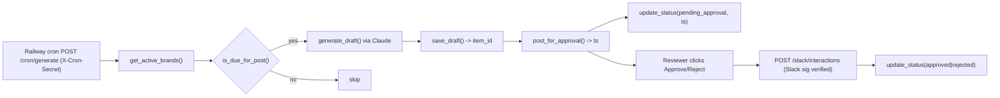

# Content Loop Agent

Brand-agnostic content loop. FastAPI on Railway, Postgres on Railway, Slack approval flow, Claude API for drafting. Live path: generate drafts → Slack Approve/Reject → optional Generate image → Publish/Schedule to Facebook via Meta Graph API (Page Access Token). See `HANDOFF.md` for the current ops truth; this README is a quick start.

## Architecture

Brands are plug-ins under `app/brands/{brand}/`. Adding a brand means adding a folder with `config.json` and `voice.md`. Removing one means deleting the folder or setting `active: false`. Nothing in `app/core/` or `app/routes/` references a brand name directly.



## Layout

```
app/main.py
app/brands/{biccu,kgc,drewber,lawbey,kemispay,kemisdigital,kemisemail,bahamas_open_data}/
    config.json, voice.md, and (biccu/kgc only) template.svg + illustrations/
app/core/{brand_loader,content_loop,db,design_loader,generation_flow,
          generator,image_generator,meta_publisher,onboarding,slack_client,
          slack_verify}.py
app/routes/{cron,deps,generate,onboarding,publish,slack_commands,
            slack_events,slack_interactions,static}.py
schema.sql
```

## Environment variables

Copy `.env.example` to `.env` locally and set in Railway variables.

| Var | Purpose |
| --- | --- |
| `ANTHROPIC_API_KEY` | Claude API key |
| `SLACK_BOT_TOKEN` | Slack bot token with `chat:write` |
| `SLACK_SIGNING_SECRET` | Slack app signing secret, used to verify interaction payloads |
| `SLACK_CONTENT_CHANNEL` | Channel where drafts are posted for approval |
| `DATABASE_URL` | Railway Postgres URL |
| `CRON_SECRET` | Shared secret. Railway cron must send `X-Cron-Secret: <value>` on `/cron/generate`. Generate this yourself, do not let Cursor pick one. |
| `ANTHROPIC_MODEL` | Optional. Defaults to `claude-sonnet-4-6`. |

## Local run

```bash
python -m venv .venv
source .venv/bin/activate
pip install -r requirements.txt
cp .env.example .env  # fill in values
psql "$DATABASE_URL" -f schema.sql
uvicorn app.main:app --reload --port 8000
```

## Manual setup checklist (steps the code does not do for you)

1. **Database** - run `schema.sql` on Railway Postgres: `psql "$DATABASE_URL" -f schema.sql`.
2. **Slack app** - create a Slack app with the scopes and endpoints below.
3. **Railway deploy** - connect this repo, set all env vars, deploy.
4. **Smoke test** - manually POST `/cron/generate` with header `X-Cron-Secret: <value>` and confirm a draft appears in Slack and Approve/Reject update `content_items.status`.
5. **Railway cron** - in the Railway dashboard, add a cron trigger that hits `POST /cron/generate` with the `X-Cron-Secret` header on your chosen schedule.

### Slack app configuration

**Bot Token Scopes (OAuth & Permissions):**
- `chat:write` - post drafts and onboarding messages.
- `app_mentions:read` - optional, if you want to trigger flows by mentioning the bot.

**Event Subscriptions (Interactivity & Shortcuts + Event Subscriptions):**
- Enable **Interactivity**, Request URL: `https://{railway-domain}/slack/interactions`
- Enable **Event Subscriptions**, Request URL: `https://{railway-domain}/slack/events`
- Subscribe to bot events: `message.channels` **and** `message.groups` — the
  ops channel is private, and without `message.groups` onboarding thread
  replies in private channels never reach the app

**In Slack:**
- Invite the bot to the content approval channel: `/invite @Content Loop`
- Invite the bot to any channel where you want to run onboarding threads.

Copy the **Signing Secret** into `SLACK_SIGNING_SECRET` and the **Bot User OAuth Token** (`xoxb-...`) into `SLACK_BOT_TOKEN`.

## Onboarding a new brand via Slack

Run Nova's onboarding interview to generate a brand's `voice.md` and `config.json` from the business's own answers. The output lands in the `brands` table and is immediately live in the content loop (no file write, no git commit).

```bash
curl -X POST -H "X-Cron-Secret: <value>" \
  -H "Content-Type: application/json" \
  -d '{"brand_id":"drewber","display_name":"Drewber Solutions","channel":"C0XXXXX"}' \
  https://{railway-domain}/onboard/start
```

Nova posts a welcome message + Phase 1 questions into a new thread in the channel. The business replies in the thread (one or several messages), then types `next` to advance. Seven phases: identity, voice, content territory, compliance, platform behavior, cadence, visual identity. After the last phase, Nova synthesizes a `voice.md` + `config.json` via Claude and posts it with Approve / Reject / Regenerate buttons. Approve persists the brand and it appears in the next cron run.

To restart an onboarding for a brand, hit `/onboard/start` again with the same `brand_id` - the session resets.

## Publishing + images (see HANDOFF.md)

- Facebook publish/schedule: direct Meta Graph API (`meta_publisher.py`). Per-brand `meta_page_id` + `meta_token_env` on each brand config.
- Image generation: design-system templates under `app/brands/{id}/template.svg` + `illustrations/`. Slack **Generate image** button. Only `biccu` and `kgc` ship templates today; brands without one get a friendly "no design system yet" message in Slack.
- Env: `META_PAGE_ID` / `META_PAGE_ACCESS_TOKEN` (BICCU), `META_KGC_PAGE_ACCESS_TOKEN` (KGC), plus one `META_*_PAGE_ACCESS_TOKEN` per additional brand (see `.env.example`). Full checklist in HANDOFF §15 and §18.

## Open items for Kenneth

- Confirm posting cadence per brand. Currently defaulted to `3` days in each `config.json`.
- New brand seeds (drewber, lawbey, kemispay, kemisdigital, kemisemail, bahamas_open_data): set the per-brand `META_*_PAGE_ACCESS_TOKEN` env vars on Railway before publishing, and run Nova onboarding for full-voice drafts (lawbey/kemispay/bahamas_open_data have stub voice files).
- Design templates (`template.svg` + `illustrations/`) exist only for biccu and kgc; other brands are text-only until templates are added.
- Instagram publishing deferred.
